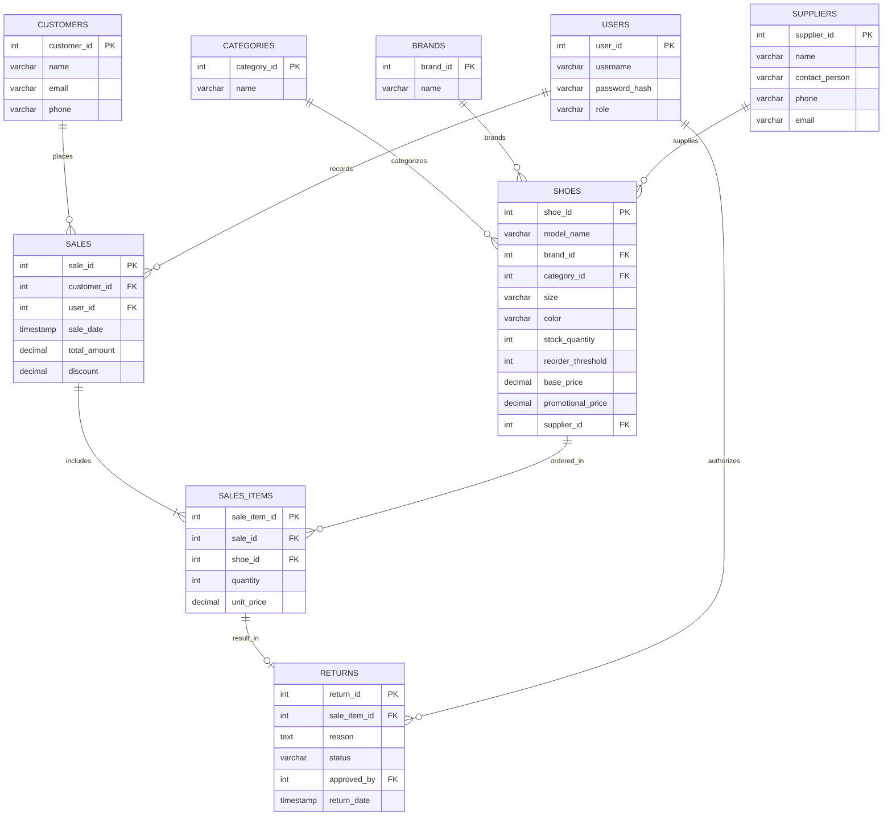

# CityStyle Footwear - Database ER Diagram

This document provides a visual and symbolic representation of the database schema for the CityStyle Footwear POS system.

## 1. Mermaid Diagram (Visual)



## 2. Symbolic Representation (Text-Based)

Legend:
- `[Table Name]` : Entity
- `pk` : Primary Key
- `fk` : Foreign Key
- `--<` : One-to-Many relationship
- `---` : One-to-One relationship

```text
[BRANDS] (pk: brand_id)
   |
   +--< [SHOES] (pk: shoe_id, fk: brand_id, category_id, supplier_id)
   |       |
[CATEGORIES] (pk: category_id)
           |
[SUPPLIERS] (pk: supplier_id)

[SHOES]
   |
   +--< [SALES_ITEMS] (pk: sale_item_id, fk: sale_id, shoe_id)
           |
[SALES] (pk: sale_id, fk: customer_id, user_id)
   |       |
   |       +--< [SALES_ITEMS]
   |
[CUSTOMERS] (pk: customer_id)
   |
[USERS] (pk: user_id)
   |
   +--< [SALES] (Processed by)
   |
   +--< [RETURNS] (Approved by)

[SALES_ITEMS]
   |
   +---o [RETURNS] (pk: return_id, fk: sale_item_id, approved_by)
```

## 3. Detailed Table Relationships

| Table A | Table B | Relationship | Description |
| :--- | :--- | :--- | :--- |
| `categories` | `shoes` | 1 : N | One category can have many shoes. |
| `brands` | `shoes` | 1 : N | One brand can have many shoe models. |
| `suppliers` | `shoes` | 1 : N | One supplier can provide multiple shoe products. |
| `customers` | `sales` | 1 : N | One customer can make multiple purchases. |
| `users` | `sales` | 1 : N | One staff member (user) can process many sales. |
| `sales` | `sales_items` | 1 : N | One sale can include multiple shoe items. |
| `shoes` | `sales_items` | 1 : N | One shoe product can be part of many sale transactions. |
| `sales_items` | `returns` | 1 : 0..1 | A sold item may or may not be returned. |
| `users` | `returns` | 1 : N | A manager (user) can approve many returns. |
